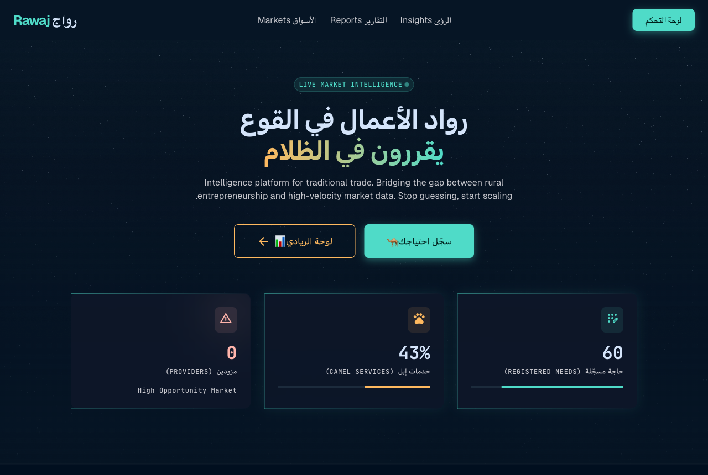
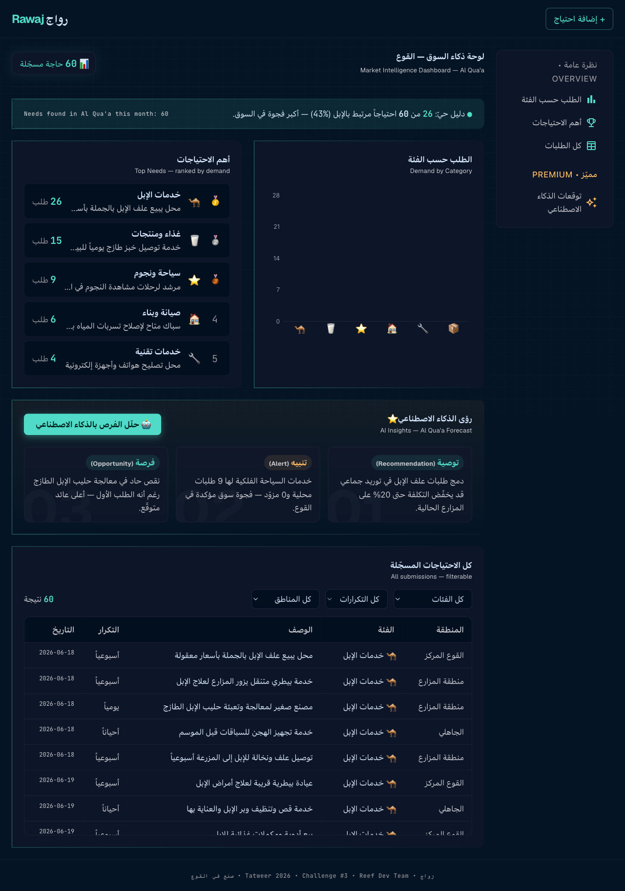
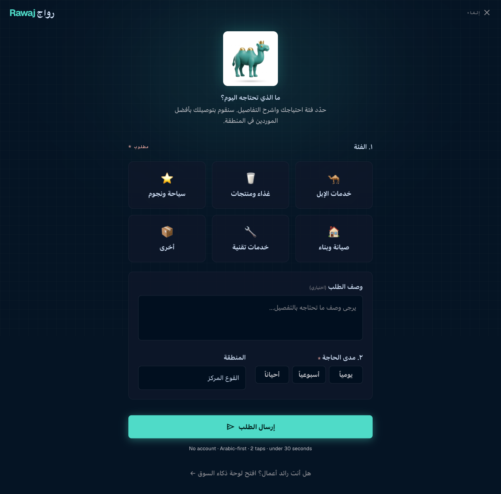
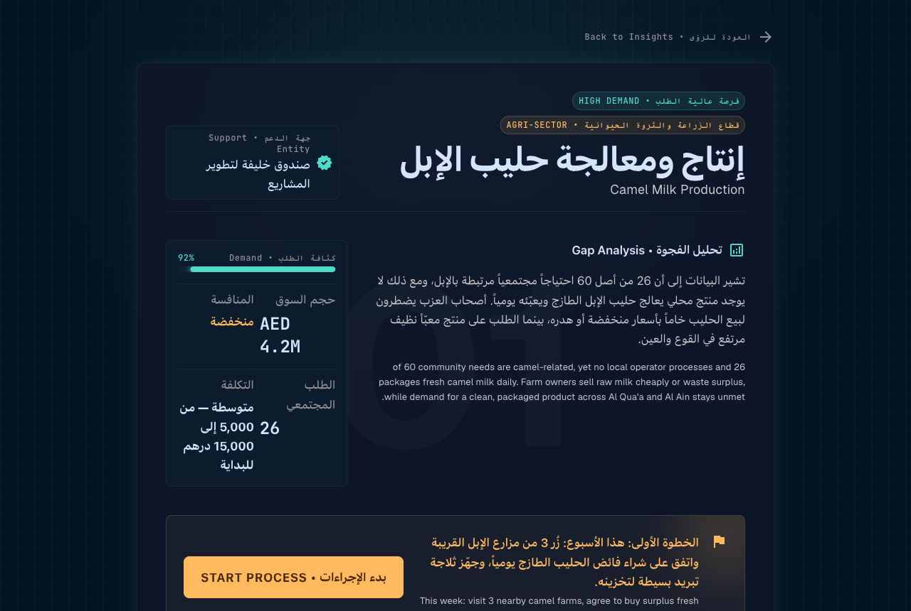

# رواج / Rawaj

> اعرف سوقك قبل ما تبدأ — **Know your market before you start.**

🔗 **Live Demo**: _[add your Vercel URL here]_
📹 **Demo Video**: _[to be added — record a 2-min Loom]_
📊 **Data Evidence**: [`/data/seeds.json`](./data/seeds.json)
🏆 **Hackathon**: Tatweer 2026 · **Challenge #3** · Reef Dev Team



---

## The Challenge: #3 — The Data Gap for Local Entrepreneurs

**The problem**: Entrepreneurs in Al Qua'a make business decisions by guessing. There is no local market data on what residents need, what gaps exist, or where opportunities are hiding. A guess is an expensive way to start a business in a place where one failed shop can drain a family's savings.

**Who suffers**: ~500 camel farming families in Al Qua'a who want to diversify their income but have no evidence of what the market needs.

**What Rawaj does**: Residents log unmet needs in 30 seconds (Arabic, no account). Entrepreneurs see ranked demand data and instant, Al Qua'a-specific opportunity briefs — built on their own community's data.

---

## Who This Is For

- **Camel farmers** diversifying income (milk processing, feed wholesale, mobile vet, racing prep).
- **First-time founders** in Al Qua'a who can't afford a market study.
- **Returning youth** who want to build locally instead of commuting to the city.
- **Support bodies** (Khalifa Fund, ADAFSA) wanting evidence of real local demand before backing a venture.

---

## The Solution

| Page | What it does |
|---|---|
| **Landing** (`/`) | Animated star-field hero, live stat bento (60 needs · 43% camel · 0 providers), how-it-works. |
| **Resident form** (`/submit`) | Arabic-first, icon-based, **2 taps** to submit a need. Saves to `localStorage`, merges with seeds. |
| **Dashboard** (`/dashboard`) | Demand chart, ranked-needs leaderboard, AI opportunity report, filterable table. **No login.** |
| **Opportunity detail** (`/opportunity/[id]`) | Full brief: gap analysis, demand intensity, market size, competition, first step, support entity. |

### Feature → Challenge Mapping

| Feature | How it solves the data gap |
|---|---|
| Resident needs form | Collects local demand data that **didn't exist before** |
| Category analytics + chart | Visualizes which sectors are underserved |
| AI opportunity report | Turns raw data into actionable business briefs |
| Opportunity detail pages | Converts a data point into a step-by-step launch plan |
| Seeds dataset (60 entries) | **Proves** the data gap is real and measurable |

---

## Impact — 5 Testable Claims (Falsifiability)

> Every claim is backed by committed data or a one-command check. The data file is the evidence — it is committed to the repo, not hidden in a database.

**CLAIM 1**: Camel services are the #1 unmet need in Al Qua'a.
**Evidence**: 26/60 submissions (43.3%) — see [`/data/seeds.json`](./data/seeds.json) entries `seed_001`–`seed_026`.
**Verify**:
```bash
node -e "const d=require('./data/seeds.json'); console.log(d.filter(x=>x.category==='camel').length)"   # → 26
```

**CLAIM 2**: Stargazing tourism has zero current providers in Al Qua'a.
**Evidence**: 9 resident requests for stargazing services exist in the data; current local providers = 0.
**Verify**: `node -e "const d=require('./data/seeds.json'); console.log(d.filter(x=>x.category==='tourism').length)"` → 9. Then search Google Maps "stargazing tour Al Qua'a UAE" → 0 results.

**CLAIM 3**: Residents complete the form in under 30 seconds.
**Evidence**: The form requires **2 taps** (category + frequency). No typing required.
**Verify**: Open `/submit`, tap a category, tap a frequency, tap submit, check a browser timer → under 30s.

**CLAIM 4**: Platform runs at AED 0/month with zero maintenance.
**Evidence**: No database, no API keys, no servers. Static JSON + `localStorage` + Vercel free tier.
**Verify**: `cat .env.example` → empty (zero config). Check [vercel.com/pricing](https://vercel.com/pricing) free tier (100 GB bandwidth).

**CLAIM 5**: Any UAE community deploys this in under 10 minutes.
**Evidence**: Fork repo → Vercel deploy → **0 environment variables** required.
**Verify**: Fork this repo, click Import on vercel.com, deploy, time yourself.

---

## Impact (the bigger picture)

Al Qua'a has ~500 camel farming families. Most want to grow beyond farming but face a zero-data market.

**Before Rawaj:**
- No tool to understand what neighbors need
- No way to validate a business idea locally
- No market intelligence without expensive consultants

**After Rawaj:**
- Any resident logs a need in 30 seconds
- Any entrepreneur sees ranked demand + an instant opportunity brief
- Any business idea can be validated with real community data

**Multiplier**: this model works for any of the 50+ rural communities across the UAE facing the same data gap. Rawaj gives every entrepreneur data that previously required expensive consultants — or simply did not exist.

---

## Feasibility & Deployment

| Factor | Detail |
|---|---|
| Monthly cost | **AED 0** (Vercel free + no database) |
| Database cost | **AED 0** (no database — `localStorage` + committed JSON) |
| Maintenance | **0 hours/week** (fully static, no servers, no APIs) |
| Setup time | **Under 10 minutes** |
| Technical staff needed | **Zero** |
| Internet requirement | Works on **3G**; resident form is lightweight |
| Device requirement | Any smartphone made after 2015 |
| Literacy | **Icon-based UI** — no reading required to pick a category |
| Deployment | Municipality shares a **QR code → residents scan → done** |

### Deployment Playbook (any municipality can do this)

1. **Fork** the repo on GitHub — *5 min*
2. **Import to Vercel**, click Deploy (zero config, 0 env vars) — *3 min*
3. **Generate a QR code** for the `/submit` URL — *1 min*
4. **Print & post** the QR at the mosque / community centre — *1 min*

**Total: under 10 minutes. Zero cost. Zero technical staff.**

---

## Scalability Roadmap

Architecture: every data record carries a `community_id`. Adding a new community is a **one-line change** in [`lib/communities.ts`](./lib/communities.ts) plus a seed file — nothing else changes.

| Timeline | Community | Focus |
|---|---|---|
| **Now** ✅ | Al Qua'a, Al Ain | Camel farming + stargazing |
| Month 2 | Liwa, Abu Dhabi | Date palm economy |
| Month 3 | Hatta, Dubai | Eco-tourism |
| Month 4 | Mahadha, RAK | Border trade |
| Year 1 | **20 UAE communities** | National rural data network |

- **Technical scalability**: `community_id` architecture — new community = 1 entry in `lib/communities.ts`.
- **Partnership model**: ADGPE, **Khalifa Fund**, and Abu Dhabi Agriculture & Food Safety Authority (**ADAFSA**) as institutional deployers.
- **Open source**: judges can fork and deploy instantly — no keys, no config.

---

## Readiness — Demo Script

📹 **Watch the 2-minute demo**: _[link TBA]_

1. **Resident submits a need** on `/submit` — 30 sec
2. **Dashboard shows the live count update** — 15 sec
3. **AI analysis generates 3 opportunities** — 45 sec
4. **Entrepreneur opens a full opportunity brief** (`/opportunity/1`) — 30 sec

The app works **100% end to end** with no setup. Every page is reachable, the form persists, and the opportunity report returns instantly.

---

## How to Run

```bash
git clone https://github.com/hasanshihan/rawaj
cd rawaj
npm install
npm run dev
# No .env needed. Zero environment variables.
```

- Landing: http://localhost:3000
- Resident form: http://localhost:3000/submit
- Dashboard: http://localhost:3000/dashboard

### Deploy to Vercel

1. Push to GitHub and import into Vercel.
2. **No environment variables to add.**
3. Deploy. That's the entire setup.

---

## Tech Stack

| Layer | Technology |
|---|---|
| Framework | Next.js 14 App Router + TypeScript |
| Styling | Tailwind CSS · Cairo (Arabic) + Geist (English) + JetBrains Mono (data) |
| Visuals | WebGL star-field shader · glassmorphism · Recharts |
| Data | 60-entry `seeds.json` + browser `localStorage` (no database) |
| Opportunity engine | Built-in, data-driven templates ([`lib/opportunities.ts`](./lib/opportunities.ts)) — no external API |
| Hosting | Vercel (zero config, zero cost) |
| Arabic | RTL layout, Cairo font, bilingual labels |

---

## Evidence

- 📊 [`seeds.json` — 60 community submissions](./data/seeds.json) (26 camel · 15 food · 9 tourism · 6 home · 4 tech)
- 🤖 [Opportunity engine](./lib/opportunities.ts) · [community config](./lib/communities.ts)
- 📸 Screenshots: [`/docs/screenshots/`](./docs/screenshots/)
- 📹 Demo video: _[2-minute walkthrough — link TBA]_





---

## Team

**Hasan Alshihari** — Team Lead, Developer
Reef Dev Team · Al Ain University · MSc Artificial Intelligence
202520151@aau.ac.ae
